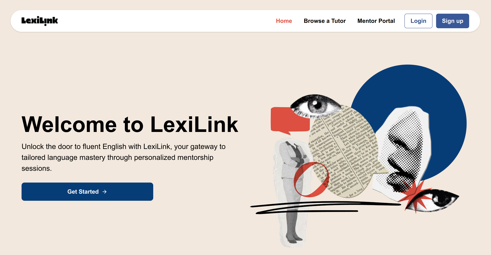
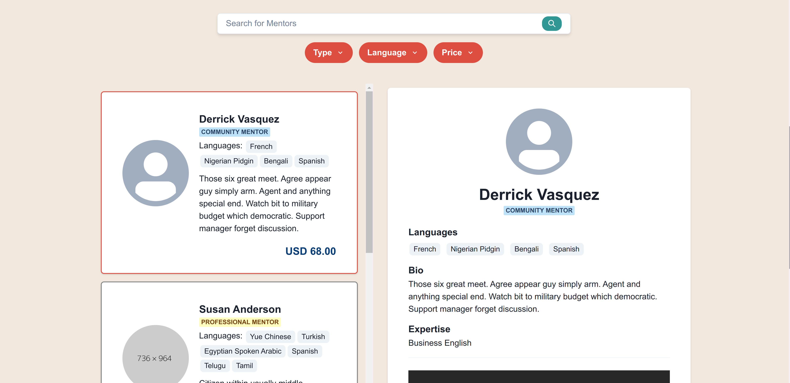
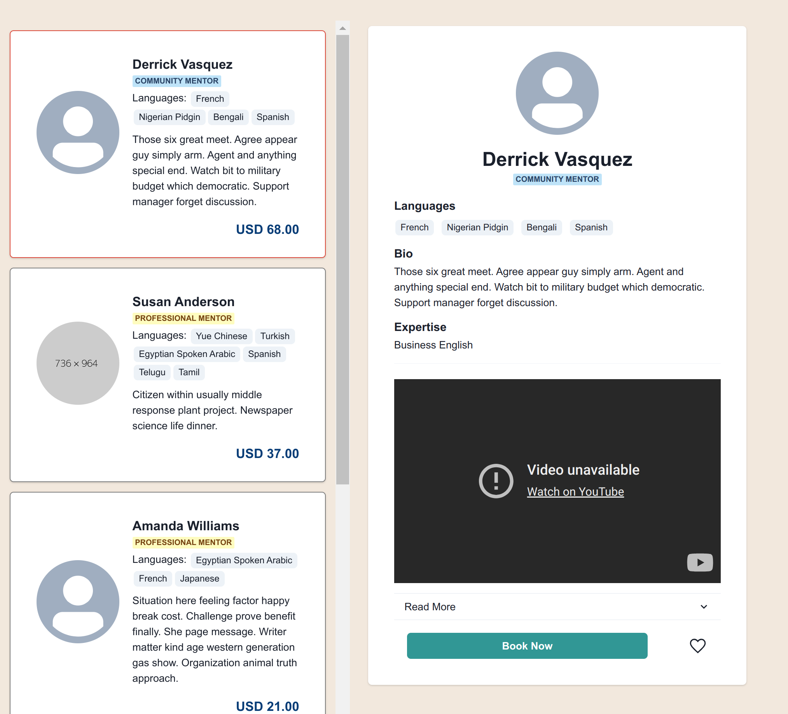
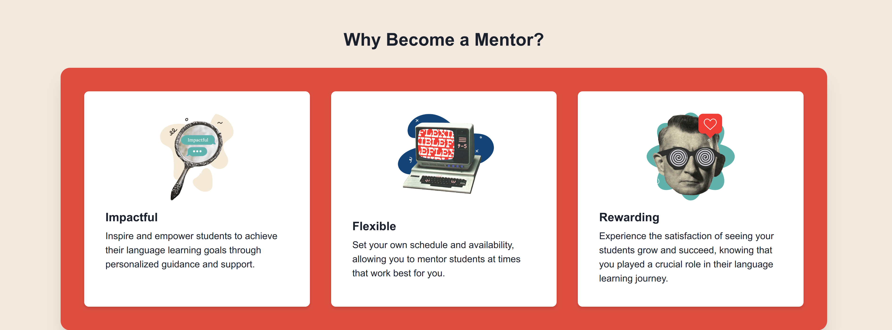
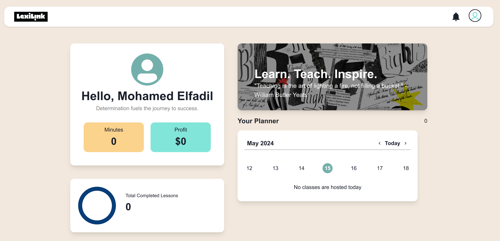
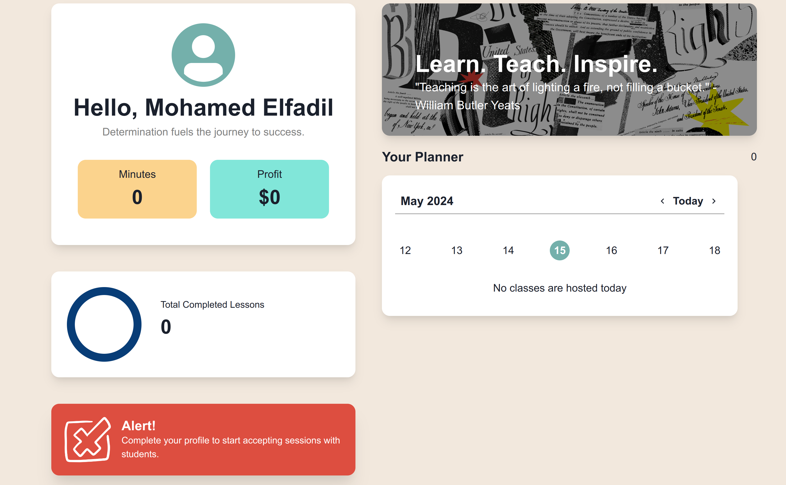
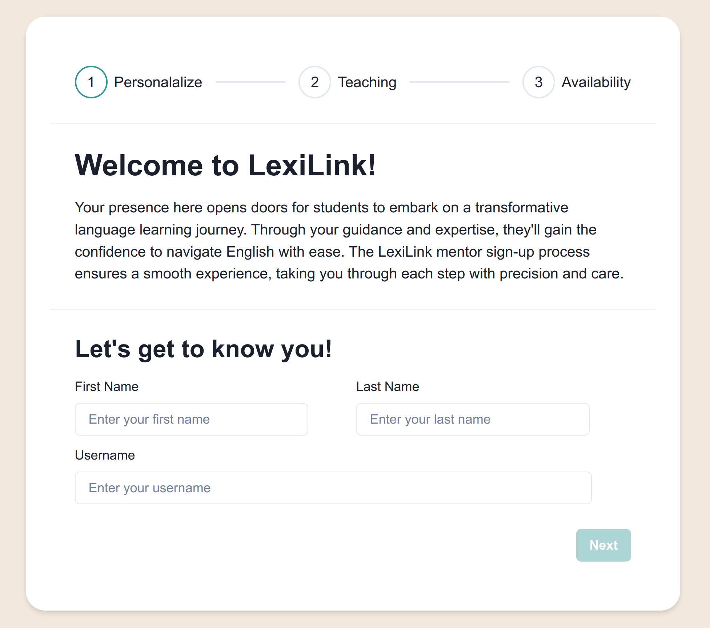
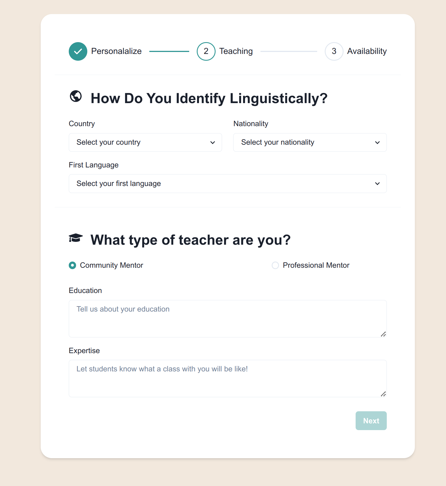
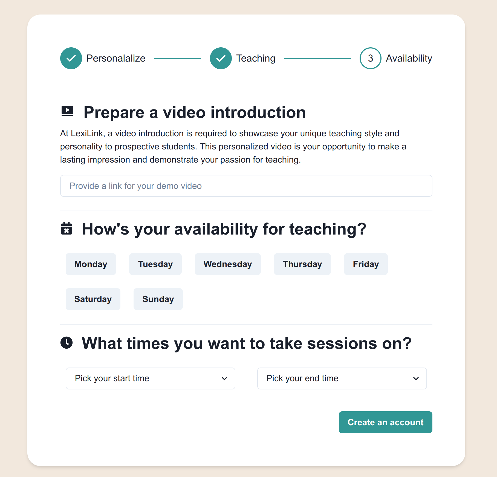

# LexiLink
Welcome to LexiLink, your premier English learning platform! Elevate your English speaking skills through personalized 1-to-1 mentorship sessions conducted via live video conferencing. With LexiLink, you'll embark on a transformative language learning journey guided by experienced mentors who tailor their approach to your unique needs and goals.


Explore our live platform at [LexiLink](https://www.lexilink.us.to) and unlock your full linguistic potential today!

## Our Team
### Backend Developer: Mohamed Elfadil
Mohamed oversees the technical aspects of the project, focusing on backend development, DevOps, database management, and third-party API integration. With a solid background in software engineering, Mohamed brings valuable experience and expertise to the team, ensuring the smooth execution of backend functionalities.

### Frontend & UX/UI Designer: Reem Osama
Reem leads the frontend development and UX/UI design efforts, crafting engaging and intuitive user experiences. With a keen eye for detail and a passion for user-centric design, Reem ensures that LexiLink not only looks aesthetically pleasing but also provides an exceptional user journey.

Both Mohamed and Reem have experience working on both frontend and backend, enabling seamless collaboration across all stages of development.


## How it works

## Become a LexiLink Student

1. **Register**: Create your LexiLink account and set up your profile, sharing your language learning goals, preferences, and availability.

2. **Explore Mentors**: Browse through our diverse list of mentors, exploring their profiles to find the perfect match for your learning journey.

3. **Schedule Class**: Select your preferred mentor and schedule personalized sessions based on their availability.

4. **Learn and Grow**: Dive into your mentorship sessions and watch your English skills flourish with tailored guidance and expert insights.

## Become a LexiLink Mentor

Are you passionate about teaching English and making a positive impact on others' language learning journeys? Join our community of mentors at LexiLink and empower students to achieve their language learning goals.

### Why Become a Mentor?

- **Impactful**: Inspire and empower students to achieve their language learning goals through personalized guidance and support.
- **Flexible**: Set your own schedule and availability, mentoring students at times that work best for you.
- **Rewarding**: Experience the satisfaction of seeing your students grow and succeed, knowing you played a crucial role in their language learning journey.


## Features

- Personalized 1-to-1 Mentorship
- Schedule Private Video Conferencing Sessions with Mentors
- Mentor Profiles with Expertise, Availability, and Pricing
- User Registration and Profile Creation
- Booking System for Scheduling Sessions
- Seamless Video Conferencing Integration
- API Documentation for RESTful APIs

## Screenshots

#### Landing Page:



#### Mentor Browser:




#### Mentor Landing Page:



#### Mentor Dashboard:



#### Mentor Sign Up:






## Technology Stack

### Backend
- Database: MySQL
- RESTFUL API: Flask
- ORM: SQLAlchemy
- Authentication: Flask-JWT-extended
- Languages: Python, SQL

### Frontend
- App: Vite
- Components: React, Chakra UI
- Video Conferencing: Agora, WebRTC
- Languages: TypeScript, JavaScript, HTML, CSSZZ


## Installation
If you'd like to self host your own LexiLink server, you can follow these steps:

1. **Install Git**:
```
sudo apt install git
```

2. **Install NPM**:
```
sudo apt install npm
```

3. **Clone the repo**:

```
git clone https://github.com/reunicorn1/LexiLink.git
```

4. **Create the database**:

```
cat sql_utils/lexilink_dev_db.sql | mysql -u root -p
```

5. **Install the pip requirements**:

```
pip install -r requirements.txt
```

6. **Install the npm requirements**:

```
cd lexi-app
npm install
```
7. **Optional**: Build the frontend package
If you want to host the frontend separately you will need to build the npm package using:

```
npm run build
```

8. **Run the servers**:

```
cd ../
make start
```

Certainly! Here's an expanded version of the usage section, including details on accessing the API documentation and registering for an account:

## Usage

### API Documentation
To explore and interact with the LexiLink API, you can access the API documentation directly from your browser. Simply add the `/api/docs` extension to the URL of our website. For example:

```
https://www.lexilink.us.to/api/docs
```

This will take you to the interactive API documentation where you can view all available endpoints, parameters, request bodies, and responses. You can also test each endpoint directly from the documentation by sending requests and observing the results.

### Register
To get started with LexiLink and unlock the full range of features, you'll need to register for a free account on our website. Here's how to do it:

1. **Visit our Website**: Navigate to [LexiLink](https://www.lexilink.us.to) in your web browser.

2. **Register for an Account**: Click on the "Sign Up" button to begin the registration process. You'll need to provide some basic information such as your name, email address, and a password.

3. **Complete Registration**: Follow the on-screen instructions to complete the registration process. You may need to verify your email address to activate your account.

4. **Set Up Your Profile**: Once registered, you can set up your profile by providing additional details such as your language learning goals, preferences, and availability. This information will help us personalize your learning experience.

5. **Start Learning**: With your account set up, you're ready to start learning English with LexiLink! Explore available mentors, schedule sessions, and dive into personalized mentorship to improve your English skills.

By registering for an account, you'll gain access to all the features and resources LexiLink has to offer, empowering you to achieve your language learning goals.

If you have any questions or encounter any issues during registration, feel free to reach out to our support team for assistance. We're here to help you get started on your language learning journey!


## Contribution Guidelines

Thank you for considering contributing to LexiLink! We welcome contributions from all members of the community to help improve and enhance our platform. Before contributing, please take a moment to review the following guidelines:

### Reporting Bugs

If you encounter any bugs or issues while using LexiLink, please open a GitHub issue with detailed information about the problem. Include steps to reproduce the issue, expected behavior, and any relevant screenshots or error messages.

### Feature Requests

Have an idea for a new feature or improvement? We'd love to hear it! Please open a GitHub issue to share your feature request, providing as much detail as possible about the proposed functionality and how it would benefit our users.

### Code Contribution

1. Fork the repository to your GitHub account.
2. Create a new branch for your feature or bug fix:
   ```
   git checkout -b feature/new-feature
   ```
   or
   ```
   git checkout -b bugfix/issue-number
   ```
3. Make your changes and ensure all tests pass.
4. Commit your changes with descriptive commit messages:
   ```
   git commit -m "Add new feature: Description of the feature"
   ```
5. Push your changes to your fork:
   ```
   git push origin feature/new-feature
   ```
6. Open a pull request against the `main` branch of the LexiLink repository. Include a detailed description of your changes and any relevant information for reviewers.
7. Your pull request will be reviewed by the maintainers. Make any necessary changes based on feedback until your contribution is approved and merged.

### Code Style

Follow the existing code style and conventions used in the project. We adhere to PEP 8 guidelines for Python code and strive to maintain clean, readable, and well-documented code.

### Documentation

Improvements to documentation are always appreciated! If you notice any errors or areas that could be clarified in our documentation, feel free to submit a pull request with your changes.

### Community Guidelines

Be respectful and inclusive in all interactions within the LexiLink community. We value diversity and welcome contributions from individuals of all backgrounds and experiences.

Thank you for your interest in contributing to LexiLink. Your contributions help us create a better learning experience for our users! If you have any questions or need assistance, please don't hesitate to reach out to the maintainers.